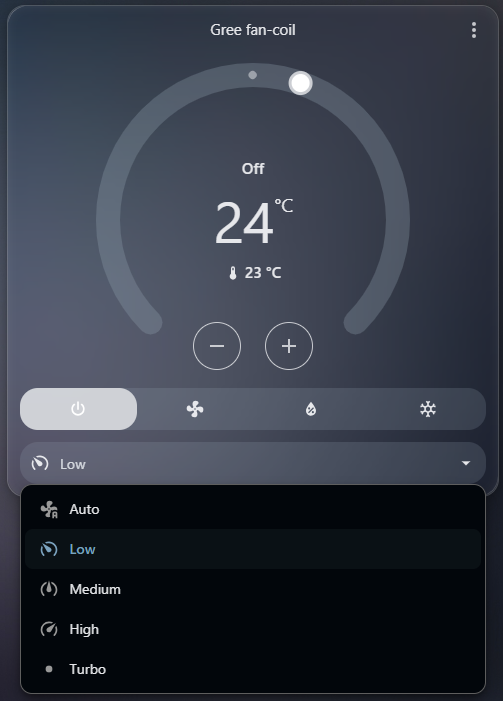

# gree-fpd-bb4-esphome

ESPHome Modbus integration for Gree FPD-34/51/68/85BB4/A-K wall-mounted fan coil units, with Home Assistant climate control, register mapping, discovery tools, and reverse-engineering notes.

[](https://github.com/jnorbi/gree-fpd-bb4-esphome/actions/workflows/validate-esphome.yml)

## Overview

This project provides a local ESPHome/Home Assistant controller for the Gree FPD-34/51/68/85BB4/A-K wall-mounted fan coil family using its RS485 Modbus interface.

It does not depend on the Gree cloud and does not emulate the factory Wi-Fi module.

The project was reverse engineered from actual fan-coil state changes and Modbus traffic, then wrapped in an ESPHome template climate entity.

## Home Assistant

The ESPHome device exposes the fan coil to Home Assistant as a climate entity for normal thermostat-style control.



## Status

### Supported model family

This project targets the complete Gree wall-mounted DC BB4/A-K family:

- Gree FPD-34BB4/A-K
- Gree FPD-51BB4/A-K
- Gree FPD-68BB4/A-K
- Gree FPD-85BB4/A-K

Gree's fan-coil service manual groups these four sizes under the same wall-mounted DC model family and installation section. The published integration is intended for this full family.

### Physically tested

The current public controller has been physically tested end-to-end on Gree FPD-68BB4/A-K with:

- Seeed Studio XIAO ESP32-C3
- Seeed Studio XIAO RS485 breakout board
- Cooling, Dry and Fan modes
- Power
- Temperature setpoint
- Auto / Low / Medium / High fan speed
- Turbo
- Vertical swing
- Sleep
- X-FAN
- Room-temperature feedback
- External state synchronization through polling

The protocol implementation and wiring target the full FPD-34/51/68/85BB4/A-K family above, but this repository does not claim that every size or hardware revision has been separately field-tested.

### Heating

Modbus Holding Register H2 value `4` is identified as Heat.

A heating-enabled configuration is included. Heating operation has not yet been field-validated, so this variant is marked experimental and deliberately conservative.

## Configuration variants

### Cooling-only

`esphome/gree-fpd-bb4-cooling-only.yaml`

Use this when the fan coil is only used for cooling.

Home Assistant exposes:

- Off
- Cool
- Dry
- Fan only

H2=4 is still detected as a physical Heat state, but Heat is not exposed as a selectable Home Assistant HVAC mode.

This is the recommended configuration for cooling-only systems.

### Heating-enabled

`esphome/gree-fpd-bb4-heating-enabled.yaml`

Adds:

- Heat

Heat currently supports:

- target temperature
- Auto / Low / Medium / High fan speed

The configuration does not assume unverified Heat behavior for X-FAN, Turbo, Sleep or swing.

## Hardware

Reference hardware:

- Seeed Studio XIAO ESP32-C3
- Seeed Studio XIAO RS485 breakout board

ESPHome pin mapping:

| Function | Pin |
|---|---:|
| RS485 TX | GPIO6 |
| RS485 RX | GPIO7 |
| RS485 DE/RE | GPIO4 |

Modbus settings:

- RTU
- 9600 baud
- 8N1
- tested slave address: 1

See [Wiring](docs/wiring.md) before connecting anything.

## Quick start

### 1. Copy the secrets file

Copy:

`esphome/secrets.example.yaml`

to:

`esphome/secrets.yaml`

and replace the placeholder values.

`secrets.yaml` is ignored by Git.

### 2. Choose a configuration

Cooling-only:

```text
esphome/gree-fpd-bb4-cooling-only.yaml
```

Heating-enabled:

```text
esphome/gree-fpd-bb4-heating-enabled.yaml
```

### 3. Wire the RS485 interface

Connect the XIAO RS485 board to the fan coil's BMS/RS485 A/B interface.

Do **not** confuse this with the separate 4-wire WMBTC02 Wi-Fi-module UART connector.

See:

- [Wiring](docs/wiring.md)
- [UART reverse-engineering notes](docs/uart-reverse-engineering.md)

### 4. Build and flash with ESPHome

The configurations require ESPHome 2026.9.0 or newer.

Example:

```bash
esphome run esphome/gree-fpd-bb4-cooling-only.yaml
```

### 5. Add the ESPHome device to Home Assistant

The main climate entity exposes the fan coil as a normal Home Assistant climate device.

Additional diagnostic entities expose connectivity, physical mode, timer state, Wi-Fi signal and uptime.

## Confirmed Modbus map

The core confirmed mappings are:

| Address | Function |
|---:|---|
| H2 | Operating mode |
| H3 | Fan speed |
| H4 | Temperature setpoint |
| H10 | Power |
| H26 | Room / return-air temperature |
| C21 | Timer active |
| C30 | Vertical swing |
| C31 | Sleep |
| C33 | X-FAN |

Important values include:

- H2: `1` Cool, `2` Dry, `3` Fan, `4` Heat
- H3: `0` Auto, `1` Low, `2` Medium, `3` High, `7` Turbo
- H10: `85 / 0x0055` Off, `170 / 0x00AA` On

See [Register map](docs/register-map.md) for the complete documented result and the observations used to identify the registers.

## Modbus discovery helper

`esphome/modbus-discovery.yaml`

The repository includes a read-only Modbus discovery firmware for scanning and verifying the register map.

It can issue:

- FC01 Read Coils
- FC02 Read Discrete Inputs
- FC03 Read Holding Registers
- FC04 Read Input Registers

The discovery helper currently uses slave address `1`. The manual start address and count are configurable from the ESPHome web interface.

Observed scan results include successful reads through:

- Holding H0-H30
- Coil C0-C87

and unsuccessful reads/timeouts immediately beyond the tested boundaries:

- H31-H37
- C88-C103

The discovery helper contains no write actions.

See [Modbus discovery](docs/discovery.md).

## Behavior implemented by the main controller

The published controller includes several pieces of state-management logic beyond raw register writes:

- avoids unnecessary mode/power writes when the requested state is already active;
- restores the last known-good cooling setpoint after leaving Heat;
- forces Low before entering Dry if the current fan speed is not valid for Dry;
- preserves the X-FAN user preference across mode changes and restores the coil state when the published control policy allows it;
- polls the physical state and reflects external changes back into Home Assistant;
- blocks writes while the Modbus connection is considered unavailable.

## Known limitations

### No HVAC Auto mode

No separate practical Modbus Auto operating mode was identified.

This is different from **fan-speed Auto**, which is supported as H3=0.

### Display / light control

Indoor-unit display/light control was not found in the confirmed RS485 register map.

The factory WMBTC02/Gree+ path can control display/light, but a specific UART display/light command has not yet been decoded.

### Heating is experimental

H2=4 is identified as Heat, but the complete heating behavior of all secondary features has not yet been physically validated.

### Write function choice

The controller uses `use_write_multiple: true` because this write behavior has been verified to work reliably on the tested setup.

## Documentation

- [Wiring](docs/wiring.md)
- [Register map](docs/register-map.md)
- [Modbus discovery](docs/discovery.md)
- [Troubleshooting](docs/troubleshooting.md)
- [WMBTC02 UART reverse-engineering notes](docs/uart-reverse-engineering.md)

## Repository layout

```text
.
├── .github/
│   └── workflows/
│       └── validate-esphome.yml
├── docs/
│   ├── images/
│   │   ├── fpd-bb4-rs485-install-overview.jpg
│   │   ├── fpd-bb4-rs485-terminal-wiring.jpg
│   │   └── home-assistant-climate-card.png
│   ├── discovery.md
│   ├── register-map.md
│   ├── troubleshooting.md
│   ├── uart-reverse-engineering.md
│   └── wiring.md
├── esphome/
│   ├── gree-fpd-bb4-cooling-only.yaml
│   ├── gree-fpd-bb4-heating-enabled.yaml
│   ├── modbus-discovery.yaml
│   └── secrets.example.yaml
├── .gitignore
├── LICENSE
└── README.md
```

## Contributing

If you test another unit or hardware revision in the FPD-34/51/68/85BB4/A-K family, or discover additional registers, please include:

- exact model number;
- ESPHome version;
- Modbus slave address;
- before/after state;
- register or coil address;
- raw value(s);
- whether the result is repeatable.

For new register discoveries, read-only confirmation is preferred before adding any write behavior.

## Safety

Fan coil units contain mains voltage.

Disconnect power before opening the unit or changing wiring, and verify the model-specific service documentation before connecting to internal terminals.
